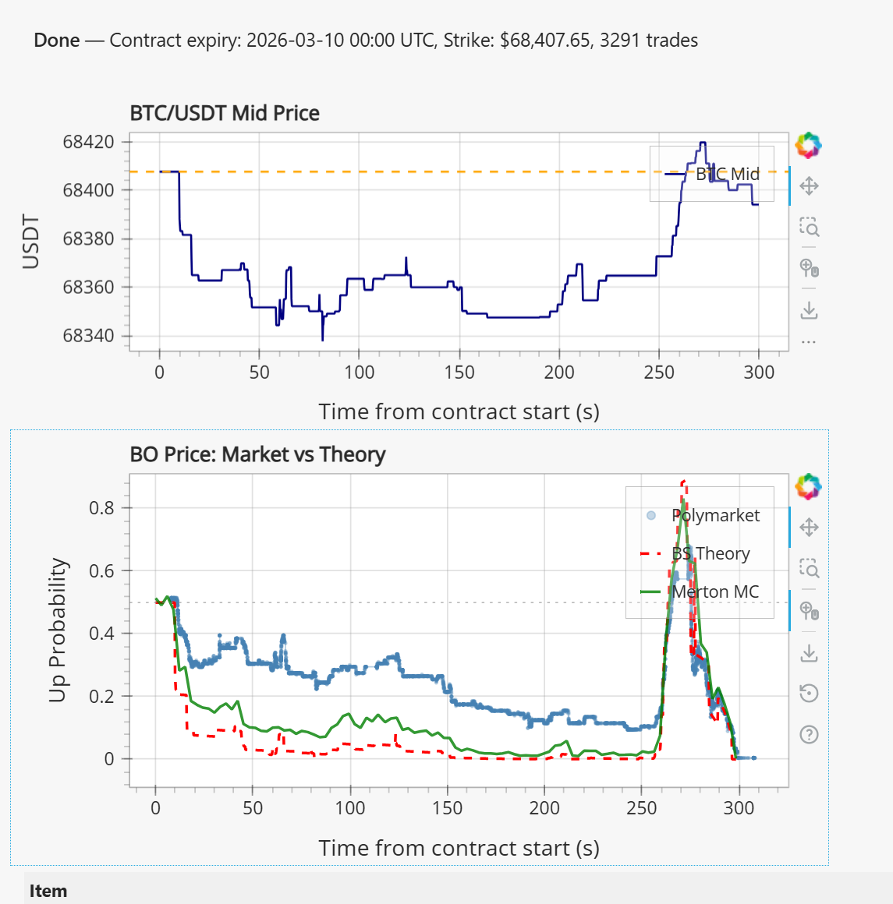

> **日本語要約**: Black-ScholesモデルとMertonジャンプ拡散モデルを用いて、Polymarketの5分BTCバイナリオプションの理論価格を算出し、実際の市場価格と比較します。Monte Carloシミュレーションのコード例を交えながら、伝統的金融モデルが暗号通貨の超短期市場でどこまで通用するかを検証します。

I've been obsessed with Polymarket's ultra-short-term BTC binary options lately. These are 5-minute contracts where you're betting whether BTC/USDT will be above or below a strike price at expiry. The tick-by-tick nature of these contracts makes them a perfect playground for testing option pricing models against reality.

The question I wanted to answer: can classical Black-Scholes or the more sophisticated Merton jump-diffusion model actually predict what Polymarket traders are pricing in? Spoiler: the answer is nuanced and interesting.

## Why Crypto Binary Options Are a Weird Beast

Binary options are the simplest derivative you can imagine. You get paid $1 if BTC is above the strike at expiry, $0 otherwise. The "fair" price is just $P(S_T > K)$ - the probability that the spot price exceeds the strike at expiration.

But crypto makes this deceptively hard to model:

- **5-minute expiries** mean you're in a regime where microstructure noise dominates
- **BTC volatility** is extreme - annualized vol ranges from 40% to 120% depending on the regime
- **Jumps happen constantly** - a single whale market order can move BTC 0.5% in seconds
- **Volatility clusters** - calm periods alternate with chaos in a very non-Gaussian way

Polymarket runs these contracts with strikes spaced around the current spot price (e.g., if BTC is at $68,450, you'll see strikes at $68,400, $68,500, $68,600). I pulled about 1,200 trades across multiple contract cycles to compare with model predictions.

## Black-Scholes for Binary Options

The standard BS framework assumes BTC follows geometric Brownian motion (GBM):

$$dS = \mu S \, dt + \sigma S \, dW$$

where $\mu$ is the drift, $\sigma$ is the volatility, and $dW$ is a Wiener process.

For a cash-or-nothing binary call (pays $1 if $S_T > K$), the analytical price is:

$$C_{binary} = e^{-rT} \cdot N(d_2)$$

where:

$$d_2 = \frac{\ln(S/K) + (r - \frac{1}{2}\sigma^2)T}{\sigma\sqrt{T}}$$

and $N(\cdot)$ is the standard normal CDF.

For 5-minute expiries, $T$ is tiny (about $9.5 \times 10^{-6}$ years), $r$ is basically zero, and the whole thing reduces to:

$$C_{binary} \approx N\left(\frac{\ln(S/K) - \frac{1}{2}\sigma^2 T}{\sigma\sqrt{T}}\right)$$

The critical input is $\sigma$. I estimated it using rolling 1-hour realized volatility from Binance tick data, annualized. Typical values during my observation period were 45-65% annualized.


The BS dashboard above shows the model tracking real prices. It works... okay. The shape is right - prices near 0.5 when the spot is at the strike, approaching 1 or 0 as you move away. But there's consistent mispricing at the tails.

## Where Black-Scholes Breaks Down

BS assumes returns are log-normally distributed. In a 5-minute window for BTC, the actual return distribution has:

1. **Fat tails**: the kurtosis of 5-minute BTC returns is typically 8-15 (normal would be 3). Extreme moves are way more likely than BS predicts.

2. **Jumps**: BTC doesn't move continuously. Liquidation cascades, large market orders, and news events create discrete jumps. In my dataset, about 3-4% of 5-minute windows had moves exceeding 3 standard deviations.

3. **Asymmetry**: negative jumps (crashes) are slightly more common and larger than positive jumps, giving negative skewness.

4. **Volatility clustering**: a big move in the last 5 minutes makes a big move in the *next* 5 minutes much more likely. BS assumes constant vol.

The practical effect: BS underprices deep out-of-the-money binaries. If the strike is $200 above spot and you have 5 minutes left, BS says "basically zero probability" but the market says "small but non-trivial" because traders know jumps happen.

## Merton Jump-Diffusion Model

Merton (1976) extended GBM by adding a compound Poisson jump process:

$$dS = (\mu - \lambda k)S \, dt + \sigma S \, dW + S \, dJ$$

where:
- $\lambda$ is the jump intensity (average number of jumps per unit time)
- $J$ is the jump size, typically $\ln(1+J) \sim N(\mu_J, \sigma_J^2)$
- $k = E[e^J - 1] = e^{\mu_J + \frac{1}{2}\sigma_J^2} - 1$ is the expected percentage jump size

The key insight: between jumps, the price follows GBM with reduced drift (to compensate for the expected jump contribution). When a jump arrives, the price instantaneously moves by a log-normal factor.

For binary option pricing under Merton, the analytical formula is a series expansion:

$$C_{binary}^{Merton} = \sum_{n=0}^{\infty} \frac{e^{-\lambda' T}(\lambda' T)^n}{n!} \cdot N(d_2^{(n)})$$

where $\lambda' = \lambda(1+k)$ and:

$$d_2^{(n)} = \frac{\ln(S/K) + (r - \frac{1}{2}\sigma_n^2 - \lambda k)T + n\mu_J}{\sigma_n\sqrt{T}}$$

$$\sigma_n = \sqrt{\sigma^2 + n\sigma_J^2 / T}$$

I calibrated the jump parameters from the empirical 5-minute return distribution:
- $\lambda = 500$ jumps/year (roughly 1 jump per 10 five-minute intervals)
- $\mu_J = -0.0002$ (slight downward bias)
- $\sigma_J = 0.003$ (jump magnitude)
- $\sigma = 0.50$ (diffusion vol, annualized)

## Interactive Simulator

Before diving into the code, try the interactive simulator below. You can adjust the model parameters (volatility, jump intensity, etc.) and run Monte Carlo simulations to see how BS and Merton pricing curves diverge in real-time.

<iframe src="/visualizations/bs-merton-sim.html" width="100%" height="580" frameborder="0" style="border: 1px solid #30363d; border-radius: 2px;"></iframe>

## Monte Carlo Simulation Approach

While the analytical Merton formula works, I also ran Monte Carlo simulations for both models. This lets me sanity-check the analytics and easily extend to more complex dynamics later.

Here's the simulation code:

```python
import numpy as np
from scipy.stats import norm

def simulate_bs_binary(S0, K, T, sigma, r=0.0, n_sims=100000):
    """
    Monte Carlo price for a binary call under GBM.
    Returns P(S_T > K).
    """
    Z = np.random.standard_normal(n_sims)
    S_T = S0 * np.exp((r - 0.5 * sigma**2) * T + sigma * np.sqrt(T) * Z)
    payoff = (S_T > K).astype(float)
    return np.exp(-r * T) * payoff.mean()


def simulate_merton_binary(S0, K, T, sigma, lam, mu_j, sigma_j,
                           r=0.0, n_sims=100000):
    """
    Monte Carlo price for a binary call under Merton jump-diffusion.
    Returns P(S_T > K) with Poisson jumps.
    """
    # Number of jumps in [0, T] for each path
    N_jumps = np.random.poisson(lam * T, n_sims)

    # Compensator for jump drift
    k = np.exp(mu_j + 0.5 * sigma_j**2) - 1
    drift = (r - 0.5 * sigma**2 - lam * k) * T

    # Diffusion component
    Z = np.random.standard_normal(n_sims)
    diffusion = sigma * np.sqrt(T) * Z

    # Jump component: sum of N_jumps log-normal jumps
    jump_component = np.zeros(n_sims)
    for i in range(n_sims):
        if N_jumps[i] > 0:
            jumps = np.random.normal(mu_j, sigma_j, N_jumps[i])
            jump_component[i] = jumps.sum()

    # Terminal price
    S_T = S0 * np.exp(drift + diffusion + jump_component)
    payoff = (S_T > K).astype(float)
    return np.exp(-r * T) * payoff.mean()


# Example: BTC at $68,450, strike at $68,500, 5 min to expiry
S0 = 68450.0
K = 68500.0
T = 5.0 / (365.25 * 24 * 60)  # 5 minutes in years
sigma = 0.55  # 55% annualized vol

# BS price
bs_price = simulate_bs_binary(S0, K, T, sigma, n_sims=500000)
print(f"BS Binary Price: {bs_price:.4f}")

# Merton price
lam = 500      # ~1 jump per 10 five-min intervals
mu_j = -0.0002
sigma_j = 0.003

merton_price = simulate_merton_binary(S0, K, T, sigma, lam, mu_j, sigma_j,
                                       n_sims=500000)
print(f"Merton Binary Price: {merton_price:.4f}")

# Analytical BS for comparison
d2 = (np.log(S0/K) + (0 - 0.5*sigma**2)*T) / (sigma*np.sqrt(T))
bs_analytical = norm.cdf(d2)
print(f"BS Analytical: {bs_analytical:.4f}")
```

The loop in `simulate_merton_binary` is intentionally naive for clarity. In practice you'd vectorize it (pre-allocate max jumps and mask), which gets you ~10x speedup. For 500k paths on a 5-minute contract, runtime is about 2 seconds on my machine.

## Comparison Against Real Polymarket Data

This is where it gets interesting. I collected trade data from Polymarket's BTC 5-minute binary contracts over several hours, tracking:
- The contract strike price
- Time remaining at each trade
- The trade price (what the market thinks P(S_T > K) is)
- Contemporaneous BTC/USDT spot from Binance

Then I computed BS and Merton model prices for each observed trade and plotted them together.



The chart shows two panels. The top panel is the BTC/USDT mid price over the observation window. The bottom panel overlays three series: Polymarket actual trade prices (what people paid), BS theoretical prices, and Merton Monte Carlo prices.

Key observations:

**1. Merton tracks the market better than BS at the extremes.** When the spot is far from the strike (contract is deep ITM or OTM), Merton prices are closer to what traders actually pay. BS snaps too aggressively to 0 or 1.

**2. Both models track well near ATM.** When the spot is close to the strike and there's 2-3 minutes left, all three lines converge. Near ATM, the jump component doesn't change the probability much since a small move in either direction is equally likely from diffusion alone.

**3. The market has a persistent "crash premium."** Polymarket prices for OTM puts (binary calls struck above spot) are slightly higher than either model predicts. Traders are assigning extra probability to upward jumps that neither model fully captures. This might reflect order flow imbalance or informed trading.

**4. Discrete price effects matter.** Polymarket contracts trade at discrete prices (0.01 increments), so very OTM contracts have a floor at $0.01-0.02 even when models say the fair value is $0.005. This creates a systematic overpricing of tail events.

## Where the Models Diverge from the Market

The biggest systematic errors I noticed:

- **Last 30 seconds**: Both models become unreliable in the final half-minute. Microstructure effects dominate - the bid-ask spread on BTC itself creates uncertainty that's not captured by either model. The market seems to use a "volatility bump" in the last few seconds.

- **During high-activity periods**: When BTC is trending (3+ consecutive 5-min candles in one direction), the market prices in momentum that neither model accounts for. BS and Merton are both martingale models - they don't believe in trends.

- **Jump clustering**: The Merton model assumes jumps arrive independently (Poisson). In reality, one jump often triggers another (liquidation cascades). During my observation period, there was a sequence of 3 rapid moves within 2 minutes that pushed the spot $150. The market repriced instantly, but Merton's independent-jump assumption meant it still underestimated tail probabilities during that episode.

## What Would Actually Work Better?

Based on these results, a few extensions seem promising:

1. **Self-exciting jump process** (Hawkes process instead of Poisson): jumps beget jumps. This would capture the clustering effect.

2. **Stochastic volatility + jumps** (SVJ or SVJJ): let $\sigma$ itself be random and correlated with returns. Heston + jumps might nail the dynamics better.

3. **Regime-switching vol**: simple two-state model (calm vs. volatile) with Markov transitions. Computationally cheap and might capture the bimodal nature of 5-min BTC vol.

4. **Just use the orderbook**: for ultra-short expiries, the BTC orderbook depth within $100-200 of the spot price is probably more informative than any parametric model. If there's a $2M bid wall $50 below, the probability of breaking through in 5 minutes is lower than any vol estimate would suggest.

## Takeaways

For anyone building pricing models for crypto binary options:

- BS is a reasonable starting point and surprisingly decent for ATM contracts with 2-5 minutes left
- Merton adds real value at the tails - if you're market-making these contracts, using BS alone will get you picked off on OTM strikes
- Neither model captures the full picture - the market knows about orderbook dynamics, momentum, and jump clustering that parametric models miss
- Monte Carlo is your friend for these short-dated contracts since path count needed is modest and you can layer in arbitrarily complex dynamics
- Calibration window matters enormously - I got best results using the last 1-2 hours of realized vol rather than daily estimates

The code above is a starting point. The real alpha is in how you estimate $\sigma$ and the jump parameters in real-time, adapting to the current market regime. But that's a topic for another post.
