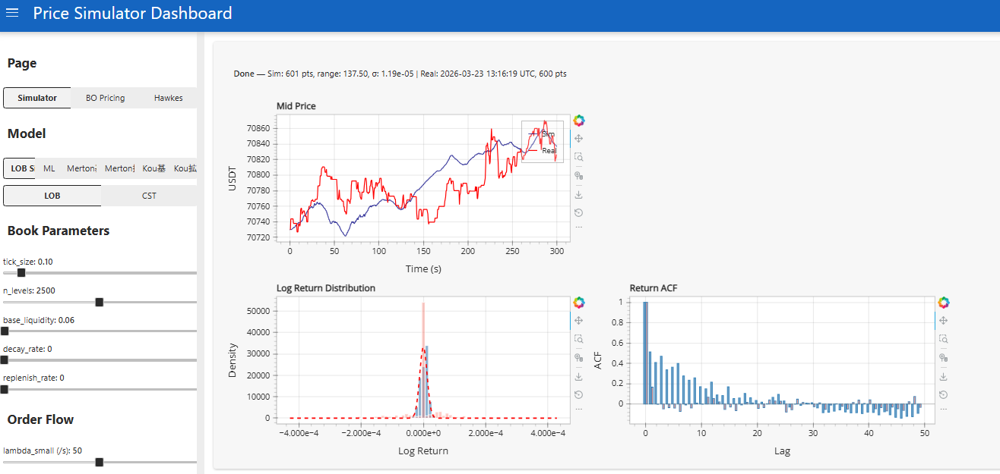
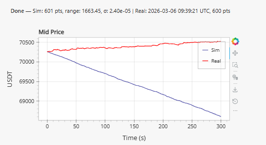
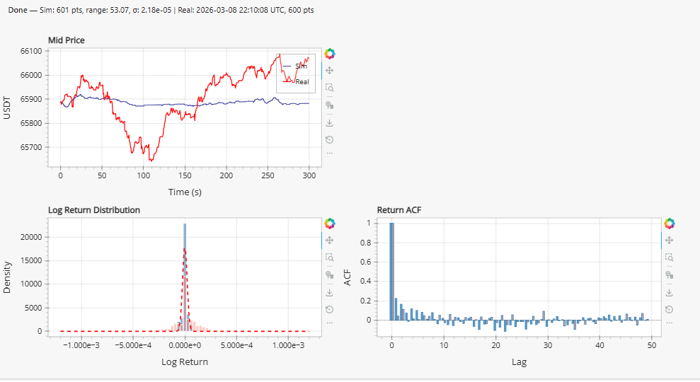

> **日本語要約**: Binance WebSocketから取得した1億5500万件超のオーダーブックレコードを効率的に処理するデータパイプラインの構築記録です。バイナリサーチローダー、Numba JITによる高速集計、LOBシミュレーターの設計に加え、AR-MLPやQuant-GANなどのML手法も試した結果と考察を共有します。

I've been working on crypto microstructure analysis for a while now, and the hardest part isn't the modeling -- it's wrangling the data. When you're looking at tick-level BTC/USDT orderbook dynamics, you're dealing with a firehose of information that will happily eat all your RAM and leave you staring at a frozen terminal.

This post covers how I built a data pipeline that can efficiently load and process 155+ million orderbook records, run aggregation at sub-second intervals, and feed the results into ML models and LOB simulators.

## The Problem

Crypto microstructure research requires tick-level data. Not 1-minute candles, not even 1-second bars -- actual individual bid/ask updates as they stream from the exchange. For BTC/USDT on Binance, that means:

- **155M+ bid/ask depth update records** (~48GB raw CSV)
- **20M trade tick records** (~6GB)
- **3.45M orderbook snapshot records** (~12GB)

All of this collected over several months from the Binance WebSocket feed. Each record has a timestamp, and we need to slice arbitrary time windows, compute derived features (mid price, VWAP, volume profiles), and feed them into models.

The goal was simple: given any arbitrary time range, produce aggregated microstructure features at 0.5-second intervals in under 2 seconds. Sounds reasonable until you realize a naive approach takes 45+ minutes just to load the data.

## Why Naive Approaches Fail

My first attempt was embarrassingly straightforward:

```python
import pandas as pd

# Don't do this with 48GB of CSVs
df = pd.read_csv("binance_btcusdt_depth_updates.csv")
```

On my 64GB workstation, this OOM'd spectacularly. Even with `chunksize`, iterating through 155M rows to find a 30-minute window was painfully slow (~3 minutes per query). Parquet helped with compression but the full scan was still the bottleneck.

The key insight: these files are already sorted by timestamp. We don't need to scan -- we need to *seek*.

## Binary Search Loader

The idea is simple. Since our CSV files are sorted by timestamp (they come from a WebSocket feed, after all), we can binary search for the starting position and only read what we need.

```python
import os
import bisect
import numpy as np
import pandas as pd
from pathlib import Path
from typing import Tuple, Optional


class BinarySearchCSVLoader:
    """
    Loads time-sliced data from large sorted CSV files using binary search.
    Builds a sparse index on first access, then seeks directly to the
    relevant byte offset for subsequent queries.
    """

    def __init__(self, csv_path: str, timestamp_col: str = "timestamp",
                 index_granularity: int = 100_000):
        self.csv_path = Path(csv_path)
        self.timestamp_col = timestamp_col
        self.granularity = index_granularity
        self._index: Optional[np.ndarray] = None
        self._offsets: Optional[np.ndarray] = None
        self._header: Optional[str] = None
        self._build_index()

    def _build_index(self):
        """Build sparse index: sample every N-th row's timestamp and byte offset."""
        timestamps = []
        offsets = []

        with open(self.csv_path, 'r') as f:
            self._header = f.readline()
            row_count = 0

            while True:
                offset = f.tell()
                line = f.readline()
                if not line:
                    break

                if row_count % self.granularity == 0:
                    ts = int(line.split(',')[0])  # timestamp is first column
                    timestamps.append(ts)
                    offsets.append(offset)

                row_count += 1

        self._index = np.array(timestamps, dtype=np.int64)
        self._offsets = np.array(offsets, dtype=np.int64)
        print(f"Index built: {len(self._index)} entries covering {row_count:,} rows")

    def load_range(self, start_ts: int, end_ts: int) -> pd.DataFrame:
        """Load only rows within [start_ts, end_ts] using binary search."""
        # Find the index entry just before our start timestamp
        idx_start = max(0, bisect.bisect_left(self._index, start_ts) - 1)
        idx_end = min(len(self._index) - 1,
                      bisect.bisect_right(self._index, end_ts))

        byte_start = self._offsets[idx_start]
        # Read until well past the end to account for granularity
        if idx_end + 1 < len(self._offsets):
            byte_end = self._offsets[idx_end + 1]
        else:
            byte_end = os.path.getsize(self.csv_path)

        bytes_to_read = byte_end - byte_start

        # Read only the relevant chunk
        from io import StringIO
        with open(self.csv_path, 'r') as f:
            f.seek(byte_start)
            chunk = f.read(bytes_to_read)

        df = pd.read_csv(StringIO(self._header + chunk))
        # Filter to exact range
        mask = (df[self.timestamp_col] >= start_ts) & \
               (df[self.timestamp_col] <= end_ts)
        return df[mask].reset_index(drop=True)
```

The index build takes about 90 seconds for the 155M-row file (one-time cost), and after that, loading any 30-minute window takes **0.8-1.2 seconds** instead of 3+ minutes. Memory usage drops from "all of it" to just the slice you need -- typically 50-200MB for a 30-minute window depending on market activity.

### Performance Numbers

| Operation | Naive (pandas) | Binary Search Loader |
|-----------|---------------|---------------------|
| Load 30-min window | 185s | 1.1s |
| Load 2-hour window | 185s (same full scan) | 3.8s |
| Memory (30-min) | 48GB+ (OOM) | ~150MB |
| Index build (one-time) | N/A | 92s |

## Numba JIT for Hot-Path Aggregation

Once we have the raw tick data loaded, we need to aggregate it into features at regular intervals. Computing mid price, VWAP, and volume at 0.5-second intervals across millions of ticks is the hot path that runs on every query.

Pure pandas/numpy was taking 800ms+ for a 30-minute window. With Numba JIT, this drops to about 45ms.

```python
import numba
import numpy as np
from numba import njit, prange


@njit(cache=True)
def compute_aggregated_features(
    timestamps: np.ndarray,    # int64, microseconds
    bid_prices: np.ndarray,    # float64
    ask_prices: np.ndarray,    # float64
    bid_volumes: np.ndarray,   # float64
    ask_volumes: np.ndarray,   # float64
    trade_prices: np.ndarray,  # float64
    trade_volumes: np.ndarray, # float64
    trade_timestamps: np.ndarray,  # int64
    interval_us: int = 500_000     # 0.5 seconds in microseconds
) -> tuple:
    """
    Compute mid price, VWAP, and volume at fixed intervals.
    All arrays must be sorted by timestamp.
    """
    t_start = timestamps[0]
    t_end = timestamps[-1]
    n_intervals = int((t_end - t_start) / interval_us) + 1

    mid_prices = np.empty(n_intervals, dtype=np.float64)
    vwaps = np.empty(n_intervals, dtype=np.float64)
    volumes = np.empty(n_intervals, dtype=np.float64)
    interval_times = np.empty(n_intervals, dtype=np.int64)

    tick_idx = 0
    trade_idx = 0

    for i in range(n_intervals):
        t_interval_start = t_start + i * interval_us
        t_interval_end = t_interval_start + interval_us
        interval_times[i] = t_interval_start

        # Advance tick pointer to end of this interval
        last_bid = 0.0
        last_ask = 0.0
        while tick_idx < len(timestamps) and timestamps[tick_idx] < t_interval_end:
            last_bid = bid_prices[tick_idx]
            last_ask = ask_prices[tick_idx]
            tick_idx += 1

        mid_prices[i] = (last_bid + last_ask) / 2.0

        # Compute VWAP and volume from trades in this interval
        vol_sum = 0.0
        pv_sum = 0.0
        while trade_idx < len(trade_timestamps) and \
              trade_timestamps[trade_idx] < t_interval_end:
            v = trade_volumes[trade_idx]
            p = trade_prices[trade_idx]
            vol_sum += v
            pv_sum += p * v
            trade_idx += 1

        volumes[i] = vol_sum
        vwaps[i] = pv_sum / vol_sum if vol_sum > 0 else mid_prices[i]

    return interval_times, mid_prices, vwaps, volumes
```

The first call takes ~2s due to JIT compilation, but subsequent calls with the same type signature hit the cache and run in 40-50ms. For interactive exploration this is a huge win -- you get near-real-time iteration on feature engineering.

## LOB Simulator

With the pipeline working, I built a Limit Order Book simulator to generate synthetic orderbook dynamics. The idea was to test whether ML models could learn microstructure patterns from simulated data before deploying on real data.



The simulator supports multiple price process models:

- **Geometric Brownian Motion** (baseline)
- **Jump Diffusion** (Merton model)
- **Self-Exciting Jump Diffusion** (Hawkes process intensity)
- **AR-MLP** (autoregressive neural network)
- **Quant-GAN** (generative adversarial network)

Each model generates price paths, and the LOB simulator wraps these with realistic order flow dynamics -- queue sizes, arrival rates, and cancellation patterns calibrated from the real Binance data.

## ML Experiments

Here's where things got interesting (and humbling).

### AR-MLP: Autoregressive MLP

The AR-MLP takes a window of past mid-price returns and orderbook imbalance features, and predicts the next 0.5s return. Architecture is straightforward: 3 hidden layers (256, 128, 64), batch norm, dropout 0.3, trained on 2 months of data.



The problem is immediately visible: **systematic drift**. The model learns a slight directional bias from the training set and compounds it over time. Even with careful normalization and detrending, the generated paths diverge from realistic price behavior after about 5 minutes of simulation.

I tried several fixes:
- Mean-centering predictions (helps but introduces weird mean-reversion artifacts)
- Predicting log returns instead of price levels (same drift, just in log space)
- Adding an explicit mean-reversion penalty to the loss (improves it but kills realistic momentum)

None fully solved it. The model captures short-term autocorrelation well but fails at longer horizons.

### Quant-GAN

The Quant-GAN approach (based on the Wiese et al. paper) uses temporal convolutional networks as both generator and discriminator, operating on sequences of log returns.



This produced more visually interesting results. The distribution of log returns from the GAN actually matches the empirical distribution reasonably well -- you can see the heavy tails are captured. But in practice:

- Training was unstable (classic GAN problems, even with spectral normalization and gradient penalty)
- Generated paths lacked the *temporal* structure of real prices -- autocorrelation of absolute returns was wrong
- Most importantly, for downstream tasks (strategy backtesting), it didn't outperform calibrated jump-diffusion

### Why Traditional Models Won

After weeks of ML experiments, I ended up using a **self-exciting jump diffusion** model for the LOB simulator. The reasons:

1. **Calibration is fast and stable** -- fit parameters via MLE on historical data in seconds
2. **Interpretable** -- you can directly see how jump intensity decays, what the baseline volatility is
3. **Hawkes-driven clustering** -- captures the volatility clustering and trade arrival patterns that matter for microstructure
4. **No drift problem** -- martingale property is built in by construction

The ML models are interesting academically, and I think with more data and better architectures (transformers, perhaps) they could eventually win. But for a practical LOB simulator where you need reliable synthetic data for strategy testing, a well-calibrated stochastic model is hard to beat.

## Pipeline Architecture Summary

The full pipeline looks like:

```
Binance WebSocket --> Raw CSVs (sorted by timestamp)
                         |
                    Binary Search Index (sparse, in-memory)
                         |
                    Time-Slice Loader (seek + read)
                         |
                    Numba Aggregator (0.5s intervals)
                         |
               +--------------------+
               |                    |
         Feature Store         LOB Simulator
               |                    |
         ML Models            Strategy Backtester
```

Total latency from "give me features for this time range" to having aggregated data ready: **~1.5 seconds** for a typical 30-minute window. This includes loading from disk, so if you're iterating on features interactively, it feels snappy enough.

## Lessons Learned

**Binary search on sorted files is underrated.** Everyone reaches for databases or Parquet partitioning, but if your data is already sorted and you need arbitrary range queries, a simple sparse index + seek gets you 90% of the way there with zero dependencies.

**Numba is magic for numerical hot paths.** The constraint is that you need to write "numpy-style" code inside the JIT function (no pandas, no Python objects), but for aggregation loops it's a perfect fit. The `cache=True` flag is essential -- without it you pay compilation cost on every restart.

**ML models for price simulation are harder than they look.** The drift problem in AR models and mode collapse in GANs are well-known, but experiencing them firsthand on real financial data is educational. The gap between "interesting paper results" and "useful tool for my workflow" is wider than I expected.

**Start with the data pipeline, not the model.** I spent the first two weeks just on the loader and aggregator, and it paid off massively. Every model experiment after that was fast to iterate on because the data was always ready in seconds.

The full pipeline code is roughly 2,500 lines of Python. Not a massive codebase, but it handles the core problem well: turning a firehose of raw WebSocket data into something you can actually work with for research.
