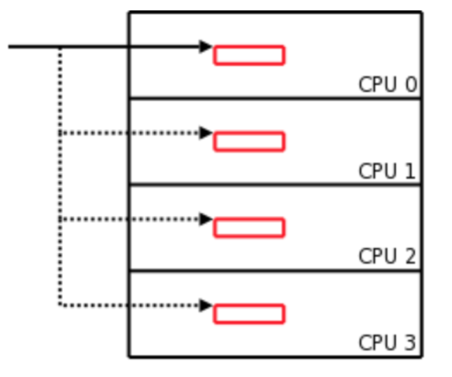

# Per cpu variable
linux kernelには、per cpu variableという機構があります。(Per-CPU Variablesとも書かれる。)  
per cpu variableはその名前の通りCPU Coreごとの変数です。
coreごとの変数を用いないとキャッシュが汚れてしまうのでパフォーマンスが大幅に低下します。
この点から、linux kernelでは多くのper cpu variableが使われています。  
  
per cpu variableが用いられている例としては、バディシステムにおけるper\_cpu\_pagesなどが挙げられます。
 
Per-CPU Variablesの概要については、Linux Device Drivers, Third Edition Chapter8 p228 (https://lwn.net/Kernel/LDD3/) にも記述があります。参考にしてください。

**注意: プログラム内のコードは解説のための疑似コードであり、動きません**

# Per cpu variableの配置
linuxはC, asm, ldsで書かれています。ちなみにCのstandard内だけで書くことはできません。このldsとはリンカスクリプトです、linuxはvmlinuxという形に実行形式をまとめますが、そのときのdataやtextなどのセクションの位置を記述しています。
per cpu variableはldsによって配置されアドレスは固定されています。  
/arch/x86/kernel/vmlinux.lds.S    
/include/asm-generic/vmlinux.lds.h    
https://elixir.bootlin.com/linux/v5.9.4/source/include/asm-generic/sections.h#L42   
```clike:title=/include/asm-generic/sections.h
extern char __per_cpu_load[], __per_cpu_start[], __per_cpu_end[];
```
こうして配置されたメモリ、data.per\_cpu\_area セクションがkernel起動時に初期化されます。  
https://elixir.bootlin.com/linux/latest/source/arch/x86/kernel/setup_percpu.c#L168  
```c:title=/arch/x86/kernel/setup_percpu.c
void __init setup_per_cpu_areas(void) {
~~
for_each_possible_cpu(cpu) {
		per_cpu_offset(cpu) = delta + pcpu_unit_offsets[cpu];
		per_cpu(this_cpu_off, cpu) = per_cpu_offset(cpu);
		per_cpu(cpu_number, cpu) = cpu;
		setup_percpu_segment(cpu);
		setup_stack_canary_segment(cpu);
		/*
		 * Copy data used in early init routines from the
		 * initial arrays to the per cpu data areas.  These
		 * arrays then become expendable and the *_early_ptr's
		 * are zeroed indicating that the static arrays are
		 * gone.
		 */
#ifdef CONFIG_X86_LOCAL_APIC
		per_cpu(x86_cpu_to_apicid, cpu) =
			early_per_cpu_map(x86_cpu_to_apicid, cpu);
		per_cpu(x86_bios_cpu_apicid, cpu) =
			early_per_cpu_map(x86_bios_cpu_apicid, cpu);
		per_cpu(x86_cpu_to_acpiid, cpu) =
			early_per_cpu_map(x86_cpu_to_acpiid, cpu);
#endif
~~

```

## Per cpu variablesの構造
per cpu variableは以下のような構造になっています。このCPU 0, CPU 1 という領域にいくつものオブジェクトが入っています。同じ変数(同名だがCPUごとに異なる変数の意味)なら各CPUの領域のstartからのoffsetは等しくなっています。    
このため、
```
（CPUiの構造体Aのptr）= (CPU0の構造体Aのptr) + (i-1)×(各CPU領域のサイズ) 
```
でそれぞれのCPUの変数アドレスを計算することができます。  
  
このような実装はChristophさんの考案です。  
参考: https://lwn.net/Articles/258238/



# RELOC_HIDE()
##  offset加算の問題点
先ほど、
（CPUiの構造体Aのポインタ）= (CPU0の構造体Aのポインタ) + (i-1)×(各CPU領域のサイズ)
で当該CPUのper cpu variableのポインタを取得できると書きましたが、ここには一つの問題があります。  
それは、**このような操作はC standardを逸脱しておりundefined behaviorに該当する**ものだということです。  
では、なにがUB(Undefined behavior)なのでしょうか？  
```
(i-1)×(各CPU領域のサイズ) = offset  
（CPUiの構造体Aのポインタ）= ptri  
(CPU0の構造体Aのポインタ) = ptr0  
```
とします。  
ここで、上の操作は ptri = ptr0 + offsetなわけですが、**このoffsetの加算は確実にptr0の指し示している構造体のサイズを超えています。 この構造体の範囲を超えるptrの加算がUBになります。**

例を示します。
```c:title=example1.c
struct person {            
    char name[20];        
    int age;                
};

int main(){
  struct person A={"Nanoha", 8}, B={"Fate", 9};
  char* ptr = &A.name;
  int* age_ptr = (int *)(ptr + 20); // in C standard
  char* B_name_ptr = (int *)(ptr + 24); // UB!
  
  printf("vars: %d, %s\n", *age_ptr, B_name_ptr); // vars: 8, Fate
}

```
構造体の中から中へoffsetを加算してptrを計算するのはCstandardに含まれますが、構造体の**外に**offsetを加算してptrを計算するのはUBです。

ただ、上のコードのように動く場合もあります。しかし、UBは「コンパイラがどう処理しても構わない」ということなので、UBを発見次第、「なのはちゃんの全力全開！」と出力してコンパイルを停止するという動作もコンパイラの裁量の範囲内になります。（ほんとか？）  

具体的には、
```c
struct person {            
    char name[20];        
    int age;                
};
int main(){
  struct person A={"Nanoha", 8}, B={"Fate", 9};
  struct person *ptr = &A; 
  if(ptr + offset > 0 && ptr + offset < ptr + sizeof(struct person)){
    ~~~~~
  }
  /*
  * ptr + offset > 0 && ptr + offset < ptr + sizeof(struct person)
  * は最適化によって、ptr + offset > 0に変換される可能性がある。
  * ptrに何を足してもその構造体のサイズを超えることがないと仮定されるため。
  */
}
```
という可能性があります。

## RELOC_HIDE
以上の問題を解決するためにRELOC\_HIDE()があります。
https://elixir.bootlin.com/linux/v4.18/source/include/linux/compiler-gcc.h#L50
```c:title=include/linux/compiler-gcc.h
#define RELOC_HIDE(ptr, off)						\
({									\
	unsigned long __ptr;						\
	__asm__ ("" : "=r"(__ptr) : "0"(ptr));				\
	(typeof(ptr)) (__ptr + (off));					\
})
```

## 拡張アセンブリ
そもそも、この拡張インラインアセンブリが読めないかもしれないので解説します。  
分かりやすい解説: http://caspar.hazymoon.jp/OpenBSD/annex/gcc_inline_asm.html　

```c
__asm__ (
          "" :          // asm template, asmのコード
          "=r"(__ptr) : // 出力レジスタ(カッコ内は対応する変数)
          "0"(ptr)      // 入力レジスタ(カッコ内は対応する変数)
        );
```
をそれぞれ意味しています。(それぞれの間を:でつないでいる。)
アセンブリはレジスタを陽に扱いますが、C言語ではレジスタは扱われません。そのため、単純にアセンブラを書くと、その瞬間レジスタにどの変数が入っているかによって、結果が変わってしまいます。その瞬間のレジスタがどの変数に対応しているかは簡単にはわかりません。この問題に対応するために拡張アセンブリ構文があります。

**拡張アセンブリ** 
1. 入力レジスタに基づいて、変数をレジスタに導入
2. asm templeteに記述されたasm code
3. 出力レジスタに基づいて、変数をレジスタに導入
というアセンブリコードを生成してくれます。

**通常のインラインアセンブリ**
1. asm templeteに記述されたasm code
だけをやってくれます。

出力入力レジスタに制約というアノテーションをつけることもでき、RELOC\_HIDE()の場合では
```
"=r" = は読み込み専用、rはどのレジスタでもいいという意味
"0"  0 は出力レジスタの0番目にこの変数を入れる
```

を意味しています。

## RELOC HIDEがやっていること
```c:title=include/linux/compiler-gcc.h
#define RELOC_HIDE(ptr, off)						\
({									\
	unsigned long __ptr;						\
	__asm__ ("" : "=r"(__ptr) : "0"(ptr));				\
	(typeof(ptr)) (__ptr + (off));					\
})
```
この拡張アセンブリはasm templeteが空文字列になっています。つまり、asmの操作は何もしないで、変数をレジスタに入れて、レジスタから変数に出すということだけを行っています。

1. 入力レジスタに基づいて、変数をレジスタに導入
2. （asm templeteに記述されたasm code）<-これがない
3. 出力レジスタに基づいて、変数をレジスタに導入

そして、どのように変数をレジスタに出し入れしているかというと、
```
ptr -> register -> __ptr 　// "0"によってptrは__ptrと同じ変数に対応付けられる
```
ということは
```
__ptr = ptr 
```
をやっているだけなんですね。
あとは、\_\_にoffsetを足して返すだけ。

これは一見なんの意味もなさそうですが、  
**アセンブリを介すことによってコンパイラのoptimizerに\_\_ptrがptrと同じ構造体のポインタであることを隠すことができます。** それによって、コンパイラはどんなサイズの構造体のポインタかわからず、offsetを足しても構造体のサイズ内なのかもしれないと考えてコード除去をすることができなくなります。

以上が RELOC_HIDE()の意味になります。

# 最後に
日本語で解説されているものがなかったので書きました。このptrの加算はアップキャストと似たようなもやっと感がありますね。こういうコードがほとんどのハードウェアの上でちゃんと動作するのはすごいことだと思いました。
