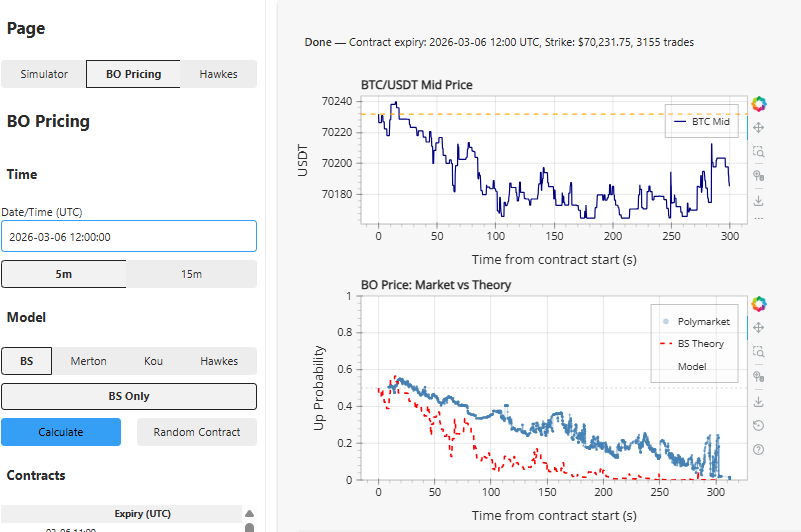
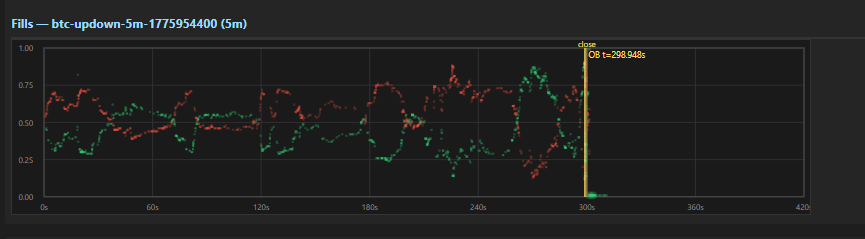

> **日本語要約**: Polymarketの予測市場におけるバイナリオプションの仕組みを開発者視点で解説する記事です。CLOB（中央指値注文帳）の構造、5分/15分BTCバイナリコントラクトのライフサイクル、APIやWebSocketを使ったデータ取得方法をPythonコード例とともに紹介します。

I've been digging into Polymarket's binary options infrastructure for the past few weeks, specifically the short-duration BTC contracts. If you're a developer looking to build trading tools, analytics dashboards, or just want to understand how these contracts actually work under the hood, this post covers what I've learned.

## What Is Polymarket and Why Binary Options?

Polymarket is a prediction market platform built on Polygon. Users trade shares in the outcome of events - political elections, sports, crypto prices, whatever. Each market resolves to either YES or NO, and shares pay out $1 if correct, $0 if wrong.

Binary options on Polymarket take this concept and apply it to price movements. Instead of "Will candidate X win the election?", you get markets like "Will BTC be above $67,500 at 14:05 UTC?" - a simple up/down bet on where price will be at a specific time.

The key insight: these are NOT traditional options with Greeks and continuous payoffs. They're binary - you either get $1 or $0. The pricing reflects the market's implied probability of the event occurring. A YES share trading at $0.62 means the market thinks there's roughly a 62% chance BTC will be above the strike at expiry.

## The CLOB: How Orders Get Matched

Polymarket runs a Central Limit Order Book (CLOB) - not an AMM. This is important because it means you get real bid/ask spreads, limit orders, and proper price discovery.

The CLOB is operated by Polymarket's exchange operator but settlement happens on-chain via their CTF (Conditional Token Framework) contracts. Here's the flow:

1. **Order placement**: You sign an order off-chain (EIP-712 typed data) specifying the token ID, side, price, and size
2. **Matching**: The exchange operator matches compatible orders
3. **Settlement**: Matched trades are settled on-chain - CTF tokens move between wallets

The order book for each binary option market has two sides: YES tokens and NO tokens. Since YES + NO = $1 always, buying YES at $0.60 is equivalent to selling NO at $0.40. The exchange handles this complementarity automatically.

What makes this interesting from a market microstructure perspective: the spreads on short-duration BTC binaries are often 2-5 cents wide. Market makers are actively quoting, and you can see the book update in real-time via WebSocket.

## 5-Minute and 15-Minute BTC Binary Contracts

The short-duration BTC markets are where things get fun. Polymarket runs rolling binary option contracts on BTC/USDT price with 5-minute and 15-minute durations.

Here's how a typical 5-minute contract works:

- **Strike**: Set at the current BTC mid-price at market creation (e.g., $67,482.50)
- **Duration**: 5 minutes from creation to resolution
- **Resolution source**: BTC/USDT price from a specified oracle feed
- **Outcome**: YES if BTC >= strike at expiry, NO otherwise

The 15-minute contracts work identically but with a longer window, which generally means tighter spreads and more liquidity since there's more time for price discovery.



The dashboard above shows the relationship between the underlying BTC/USDT mid price and the binary option price curves. You can see how the BO price responds non-linearly to moves in the underlying - this is basically the CDF of the implied distribution compressed into a 5-minute window.

One thing that tripped me up initially: the contract creation is staggered. New 5m contracts launch every 5 minutes, so at any given time you might have an active contract with 3 minutes remaining and a new one that just opened. The overlap creates interesting arbitrage dynamics.

## Contract Lifecycle

Every binary option contract goes through distinct phases:

### 1. Creation
The market is created with a condition ID, strike price, and expiry timestamp. The CTF contract mints the initial token positions. At this point, YES and NO tokens exist but no one has traded yet.

### 2. Trading Period
Orders flow in. Market makers post bids and asks on both sides. As BTC moves relative to the strike, the BO price adjusts. The closer to expiry, the more sensitive the price becomes to small moves in the underlying (gamma increases, if you want to think in options terms).

### 3. Settlement
At expiry, the oracle reports the BTC price. The contract resolves: if BTC >= strike, YES tokens are redeemable for $1 each. NO tokens become worthless. Redemption happens on-chain through the CTF contract.



The fills chart above shows actual trades on a 5m binary market. Notice how trade frequency and size increase as we approach expiry - that's participants reacting to last-second price moves in BTC.

## Accessing Polymarket Data Programmatically

Polymarket exposes two main interfaces for developers:

### REST API (CLOB API)

The CLOB API gives you access to markets, order books, and trade history. Base URL is `https://clob.polymarket.com`.

Key endpoints:
- `GET /markets` - list available markets (filterable by tag, status)
- `GET /book?token_id={id}` - current order book snapshot
- `GET /trades?market={id}` - recent trade history
- `GET /prices?token_id={id}` - price history with OHLC data

### WebSocket

For real-time data, you connect to the WebSocket feed at `wss://ws-subscriptions-clob.polymarket.com/ws/market`. You subscribe to channels per market and get:
- Order book updates (bids/asks added/removed)
- Trade notifications
- Market status changes

Here's a basic Python script to fetch market data and inspect a BTC binary option:

```python
import requests
import json
from datetime import datetime

CLOB_BASE = "https://clob.polymarket.com"

def get_btc_binary_markets():
    """Fetch active BTC binary option markets."""
    resp = requests.get(
        f"{CLOB_BASE}/markets",
        params={"tag": "btc-binary", "active": "true"}
    )
    resp.raise_for_status()
    markets = resp.json()
    return markets

def get_order_book(token_id: str):
    """Get current order book for a binary option token."""
    resp = requests.get(
        f"{CLOB_BASE}/book",
        params={"token_id": token_id}
    )
    resp.raise_for_status()
    return resp.json()

def get_recent_trades(condition_id: str, limit: int = 50):
    """Fetch recent trades for a market."""
    resp = requests.get(
        f"{CLOB_BASE}/trades",
        params={"market": condition_id, "limit": limit}
    )
    resp.raise_for_status()
    return resp.json()

# Fetch active BTC binary markets
markets = get_btc_binary_markets()

for market in markets[:3]:
    print(f"Market: {market['question']}")
    print(f"  Condition ID: {market['condition_id']}")
    print(f"  End Date: {market['end_date_iso']}")
    print(f"  Tokens: YES={market['tokens'][0]['token_id'][:12]}...")
    print(f"          NO={market['tokens'][1]['token_id'][:12]}...")

    # Get the order book for YES token
    yes_token_id = market['tokens'][0]['token_id']
    book = get_order_book(yes_token_id)

    if book.get('bids') and book.get('asks'):
        best_bid = float(book['bids'][0]['price'])
        best_ask = float(book['asks'][0]['price'])
        print(f"  Best Bid: ${best_bid:.3f}")
        print(f"  Best Ask: ${best_ask:.3f}")
        print(f"  Spread: ${best_ask - best_bid:.3f}")
    print()
```

## Parsing Trade Data

Once you have trade data, you usually want to reconstruct what happened - who was aggressive, what the fill rate looked like, how price evolved. Here's how I parse trade data from the API:

```python
import pandas as pd
from datetime import datetime, timezone

def parse_trades_to_df(trades: list) -> pd.DataFrame:
    """Parse raw trade data into a DataFrame with derived fields."""
    records = []
    for trade in trades:
        ts = datetime.fromisoformat(
            trade['timestamp'].replace('Z', '+00:00')
        )
        records.append({
            'timestamp': ts,
            'price': float(trade['price']),
            'size': float(trade['size']),
            'side': trade['side'],  # 'BUY' or 'SELL'
            'fee_rate': float(trade.get('fee_rate_bps', 0)) / 10000,
            'notional': float(trade['price']) * float(trade['size']),
        })

    df = pd.DataFrame(records)
    if df.empty:
        return df

    df = df.sort_values('timestamp').reset_index(drop=True)

    # Compute running VWAP
    df['cum_notional'] = df['notional'].cumsum()
    df['cum_size'] = df['size'].cumsum()
    df['vwap'] = df['cum_notional'] / df['cum_size']

    # Tag aggressive side (taker)
    df['is_buyer_taker'] = df['side'] == 'BUY'

    # Time until expiry (assuming market_end is known)
    return df

# Example usage
trades = get_recent_trades(markets[0]['condition_id'], limit=100)
df = parse_trades_to_df(trades)

print(f"Total trades: {len(df)}")
print(f"Total volume: ${df['notional'].sum():.2f}")
print(f"VWAP: ${df['vwap'].iloc[-1]:.4f}")
print(f"Buyer-taker ratio: {df['is_buyer_taker'].mean():.1%}")
print(f"\nLast 5 trades:")
print(df[['timestamp', 'price', 'size', 'side']].tail())
```

A few things I noticed when working with this data:

- Trades come back in batches - the API doesn't guarantee strict ordering within the same block timestamp
- Fee rates vary by maker/taker status and can be 0 for makers on certain markets
- The `size` field is in shares (not USD) - multiply by price to get notional
- During high-volatility moments, you'll see clusters of fills at the same timestamp as the book gets swept

## Practical Challenges

A few gotchas if you're building on this:

**Rate limits**: The CLOB API has rate limits that aren't always clearly documented. I found ~100 requests/minute to be safe for the REST endpoints. Use WebSocket for anything real-time.

**Token ID vs Condition ID**: Markets have a `condition_id` (the overall market) and individual `token_id`s for YES and NO positions. Some endpoints want one, some want the other. The order book endpoint takes `token_id`, while trades takes the market's `condition_id`.

**Timing**: For 5-minute binaries, even 500ms of latency matters. If you're building a trading bot, you need to account for the time between your price observation and order arrival at the exchange.

**Resolution edge cases**: What happens if the oracle price is exactly at the strike? In Polymarket's implementation, >= resolves to YES. But double-check the specific market's resolution rules - they're in the market description.

## Wrapping Up

Polymarket's binary options are a surprisingly clean environment for building trading tools. The CLOB gives you proper market microstructure to analyze, the contracts are simple enough to model (binary payoff + time decay), and the API access is decent for a crypto platform.

If you're coming from TradFi options or DeFi AMMs, the mental model shift is: think of these as extremely short-dated digital options with discrete settlement. The pricing behavior near expiry is where all the action happens - and where the data gets interesting.

I'm working on a follow-up post covering how to model the implied probability surface across multiple strikes and durations. If you're building something similar, feel free to reach out.
