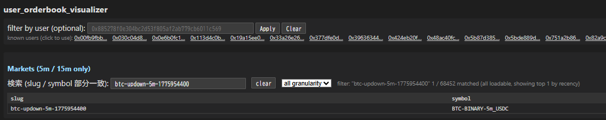
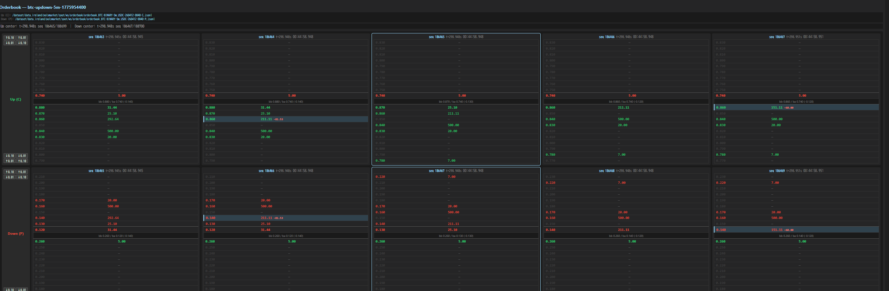

> **日本語要約**: Polymarketの5分BTCバイナリオプションのL2オーダーブックを分析した記事です。FastAPI + vanilla JSで構築したビジュアライザーを使い、スプレッドの推移、流動性のパターン、スナップショット間のサイズ変化を可視化。市場効率性への考察も行います。

I've been spending way too much time staring at Polymarket's 5-minute BTC binary options lately. Not trading them (well, not much), but pulling apart their orderbooks to understand what's actually happening in these ultra-short-duration prediction markets. Here's what I found and the tool I built to see it all.

## Why Orderbook Analysis Matters for Prediction Markets

Most people look at prediction markets from the price/probability angle: "What does the market think the odds are?" But if you dig into the L2 orderbook, you get a much richer picture. You can see:

- **Who's confident** (large resting orders near the mid)
- **Who's uncertain** (thin books with wide spreads)
- **When the market is about to move** (liquidity getting pulled from one side)
- **Market maker behavior** (symmetric adjustments, inventory management)

For 5-minute binary options on BTC price, this is especially interesting because the entire lifecycle of the market plays out in 300 seconds. You get to watch an orderbook be born, mature, and die in the time it takes to make coffee.

## L2 Orderbook Structure on Polymarket

Polymarket runs a CLOB (Central Limit Order Book) on their hybrid exchange. For binary options, you have two outcome tokens -- let's call them YES and NO (or in the BTC case, UP and DOWN). Each outcome has its own orderbook with bids and asks.

Key things to understand:

- **Prices are probabilities**: A bid of 0.65 on YES means someone is willing to pay $0.65 for a token that pays $1.00 if the event happens. That's an implied probability of 65%.
- **Complementary pricing**: YES at 0.65 and NO at 0.35 should be equivalent (minus spread). If YES bid is 0.60 and NO bid is 0.35, there's a 0.05 gap representing the spread/profit for market makers.
- **Size represents conviction**: A $5,000 order at 0.50 is very different from a $50 order at the same price.

The L2 data gives you multiple price levels deep on each side. For these 5-minute markets, you typically see 3-8 meaningful levels before the book gets sparse.

## Building the Orderbook Visualizer

I wanted to see how the orderbook evolves over the life of a 5-minute contract. Not just the final state, but snapshots over time, side by side, with changes highlighted. So I built a simple tool.

### Architecture: FastAPI + Vanilla JS

Nothing fancy. FastAPI backend that polls Polymarket's API for orderbook snapshots, stores them, and serves them to a vanilla JS frontend that renders the books visually.



The market selector lets you pick which 5-minute contract to analyze. I filter for markets where there was actual user trading activity (not just market maker quotes sitting there).

### Snapshot Caching with LRU

Since these markets are short-lived, I cache snapshots aggressively. Each market gets polled every 2 seconds during its active window, giving ~150 snapshots per contract.

```python
from functools import lru_cache
from datetime import datetime
import httpx

class OrderbookSnapshotCache:
    def __init__(self, max_snapshots_per_market=200):
        self.snapshots: dict[str, list[dict]] = {}
        self.max_snapshots = max_snapshots_per_market

    async def capture_snapshot(self, market_id: str, token_id: str):
        async with httpx.AsyncClient() as client:
            resp = await client.get(
                f"https://clob.polymarket.com/book",
                params={"token_id": token_id}
            )
            book = resp.json()

        snapshot = {
            "timestamp": datetime.utcnow().isoformat(),
            "bids": [(float(o["price"]), float(o["size"])) for o in book["bids"]],
            "asks": [(float(o["price"]), float(o["size"])) for o in book["asks"]],
            "best_bid": float(book["bids"][0]["price"]) if book["bids"] else 0,
            "best_ask": float(book["asks"][0]["price"]) if book["asks"] else 1,
        }

        if market_id not in self.snapshots:
            self.snapshots[market_id] = []

        snaps = self.snapshots[market_id]
        snaps.append(snapshot)
        if len(snaps) > self.max_snapshots:
            snaps.pop(0)

        return snapshot

    def get_window(self, market_id: str, start_idx: int, window_size: int = 5):
        """Get a window of consecutive snapshots for side-by-side display."""
        snaps = self.snapshots.get(market_id, [])
        end_idx = min(start_idx + window_size, len(snaps))
        return snaps[start_idx:end_idx]
```

### Computing Deltas Between Snapshots

This is where it gets interesting. I compute the difference between consecutive snapshots so you can see at a glance what changed -- did size get added or pulled at a given level?

```python
from dataclasses import dataclass
from typing import Optional

@dataclass
class LevelDelta:
    price: float
    prev_size: float
    curr_size: float
    delta: float
    is_new: bool
    is_removed: bool

    @property
    def direction(self) -> str:
        if self.is_new:
            return "new"
        if self.is_removed:
            return "removed"
        if self.delta > 0:
            return "increased"
        if self.delta < 0:
            return "decreased"
        return "unchanged"


def compute_book_deltas(
    prev_snapshot: dict,
    curr_snapshot: dict,
    side: str = "bids"
) -> list[LevelDelta]:
    """
    Compare two orderbook snapshots and return per-level deltas.
    Highlights new levels, removed levels, and size changes.
    """
    prev_levels = {price: size for price, size in prev_snapshot[side]}
    curr_levels = {price: size for price, size in curr_snapshot[side]}

    all_prices = sorted(
        set(prev_levels.keys()) | set(curr_levels.keys()),
        reverse=(side == "bids")
    )

    deltas = []
    for price in all_prices:
        prev_size = prev_levels.get(price, 0.0)
        curr_size = curr_levels.get(price, 0.0)

        deltas.append(LevelDelta(
            price=price,
            prev_size=prev_size,
            curr_size=curr_size,
            delta=curr_size - prev_size,
            is_new=(price not in prev_levels),
            is_removed=(price not in curr_levels),
        ))

    return deltas


def compute_spread(snapshot: dict) -> float:
    """Spread as percentage of mid price."""
    if not snapshot["bids"] or not snapshot["asks"]:
        return float("inf")
    best_bid = snapshot["bids"][0][0]
    best_ask = snapshot["asks"][0][0]
    mid = (best_bid + best_ask) / 2
    return (best_ask - best_bid) / mid * 100
```

### The Frontend: Rendering Orderbook Levels

The frontend displays 5 consecutive snapshots side by side. Each level is color-coded based on whether size increased (green), decreased (red), is new (blue), or was removed (gray strikethrough).

```html
<div id="orderbook-window" class="snapshots-container"></div>

<style>
  .level { display: flex; font-family: monospace; font-size: 12px; padding: 2px 4px; }
  .level.increased { background: rgba(0, 255, 0, 0.1); }
  .level.decreased { background: rgba(255, 0, 0, 0.1); }
  .level.new { background: rgba(0, 100, 255, 0.15); border-left: 2px solid #06f; }
  .level.removed { opacity: 0.4; text-decoration: line-through; }
  .price { width: 60px; text-align: right; margin-right: 8px; }
  .size { width: 80px; }
  .delta { width: 60px; color: #666; font-size: 11px; }
</style>
```

```javascript
function renderOrderbookLevel(level, side) {
  const el = document.createElement('div');
  el.className = `level ${level.direction}`;

  const priceEl = document.createElement('span');
  priceEl.className = 'price';
  priceEl.textContent = level.price.toFixed(2);

  const sizeEl = document.createElement('span');
  sizeEl.className = 'size';
  sizeEl.textContent = `$${level.curr_size.toFixed(0)}`;

  const deltaEl = document.createElement('span');
  deltaEl.className = 'delta';
  if (level.delta !== 0 && !level.is_new && !level.is_removed) {
    const sign = level.delta > 0 ? '+' : '';
    deltaEl.textContent = `${sign}${level.delta.toFixed(0)}`;
    deltaEl.style.color = level.delta > 0 ? '#0a0' : '#c00';
  }

  if (side === 'bid') {
    el.append(deltaEl, sizeEl, priceEl);
  } else {
    el.append(priceEl, sizeEl, deltaEl);
  }

  return el;
}

function renderSnapshot(snapshot, deltas, container) {
  const header = document.createElement('div');
  header.className = 'snapshot-header';
  const ts = new Date(snapshot.timestamp);
  header.textContent = `${ts.getMinutes()}:${ts.getSeconds().toString().padStart(2, '0')}`;
  container.appendChild(header);

  const spread = ((snapshot.best_ask - snapshot.best_bid) * 100).toFixed(1);
  const spreadEl = document.createElement('div');
  spreadEl.className = 'spread-indicator';
  spreadEl.textContent = `spread: ${spread}c`;
  container.appendChild(spreadEl);

  // Render asks (reversed so lowest ask is closest to spread)
  const askDeltas = deltas.asks.slice().reverse();
  askDeltas.forEach(level => {
    container.appendChild(renderOrderbookLevel(level, 'ask'));
  });

  // Render bids
  deltas.bids.forEach(level => {
    container.appendChild(renderOrderbookLevel(level, 'bid'));
  });
}
```



The visualization above shows 5 consecutive L2 orderbook snapshots for both UP and DOWN outcomes. You can clearly see the book evolving -- levels appearing and disappearing, sizes adjusting, spreads tightening and widening.

## Observations From the Data

After watching a few hundred of these 5-minute contracts, some patterns become very clear.

### Spread Dynamics: Tight at Start, Wide Near Expiry

At market open (T+0), spreads are typically 2-4 cents. Market makers are happy to provide liquidity because there's plenty of time for the underlying (BTC) to move and create trading opportunities.

As expiry approaches (T+4:30 onwards), spreads blow out to 8-15 cents. This makes total sense -- the market maker's gamma risk is enormous in the last few seconds. A $10 move in BTC can flip the outcome, and you don't want to be caught on the wrong side with tight quotes.

### Liquidity Clustering Around Key Levels

Unsurprisingly, the thickest liquidity clusters around:

- **0.50**: The "I have no idea" price. Early in the contract when BTC hasn't moved much, both sides stack size at 50 cents.
- **Round numbers (0.20, 0.30, 0.70, 0.80)**: Psychological anchors. People set limit orders at these levels.
- **0.05 and 0.95**: The "almost certain" levels. Large size here from people willing to bet on near-certainties at favorable odds.

### Size Delta Patterns: Market Maker Inventory Management

The deltas reveal classic market-making behavior:

1. **Symmetric pulls**: When a market maker wants to reduce exposure, they simultaneously reduce size on both bid and ask. You see negative deltas on both sides in the same snapshot.
2. **Leaning**: When BTC starts trending in one direction, you can see market makers shift their quotes -- adding size on the side they want to get filled, reducing on the side they don't.
3. **Refreshing**: After a fill, new size appears at the same or adjacent level within 2-4 seconds. This is the MM replenishing their quote.

### The "Close" Event: Last 10 Seconds

The final 10 seconds are wild. Here's what consistently happens:

1. **T-10s**: Market makers start pulling quotes aggressively. Book thins out.
2. **T-7s**: Spreads hit maximum. Only stale quotes remain.
3. **T-5s**: Aggressive traders market-order into whatever's left, knowing the outcome is nearly certain.
4. **T-2s**: Book is basically empty. Anyone still quoting is either a bot with a direct feed or someone who forgot to cancel.

The delta visualization makes this collapse very visible -- you see a cascade of "removed" levels (gray strikethrough) rippling through the book in the final snapshots.

## Market Efficiency Implications

A few takeaways about market efficiency in these ultra-short contracts:

**These markets are surprisingly efficient mid-life.** Between T+30s and T+4:00, the prices track BTC movements well. The orderbook adjusts within 2-4 seconds of BTC price changes.

**But they're inefficient at the edges.** In the first 10 seconds and last 10 seconds, there are clear mispricings. At open, it takes time for the book to populate and find fair value. At close, the liquidity vacuum creates slippage that benefits anyone with a fast feed.

**The spread IS the market's uncertainty measure.** Wider spreads = more disagreement about the outcome. You can actually use the spread time series as a proxy for realized volatility of the underlying during that 5-minute window.

**Size matters more than price.** A level with $5,000 behind it at 0.48 is much more informative than a level with $20 at 0.52. The orderbook depth weighted by size gives you a better probability estimate than the mid-price alone.

## What's Next

I'm planning to:
- Add historical spread analytics per market (average spread curve over contract lifetime)
- Build a simple signal from book imbalance (total bid size vs total ask size) to predict short-term direction
- Overlay BTC price feed to correlate orderbook changes with underlying movements

The visualizer has been a great tool for building intuition about these markets. If you're interested in prediction market microstructure, I'd highly recommend building something similar -- there's no substitute for watching the books move in real time.

The full code is a mess of FastAPI routes and vanilla JS spaghetti, but the core logic above should be enough to get you started. The Polymarket CLOB API is well-documented and rate limits are generous enough for 2-second polling on a handful of markets.
