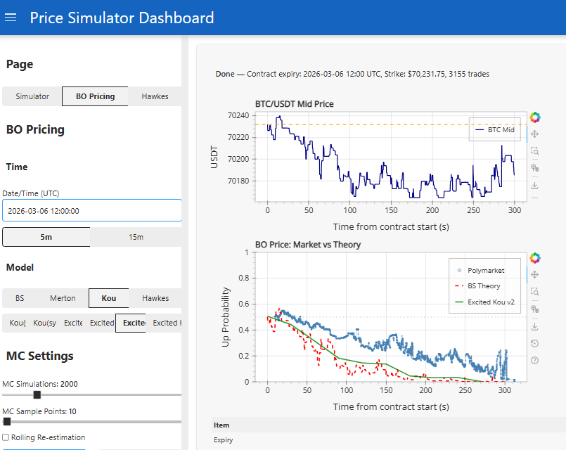
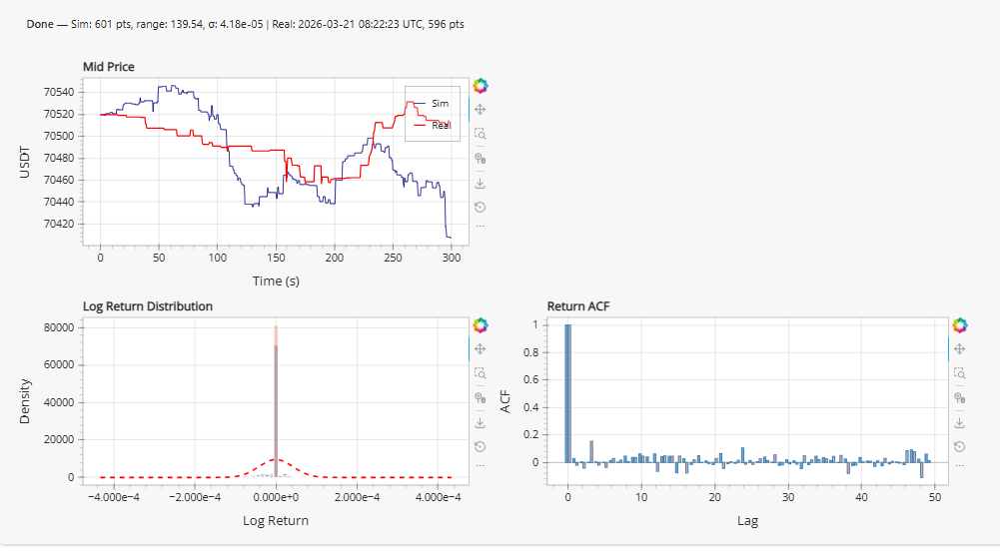
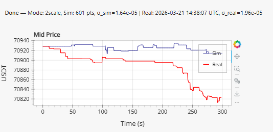

> **日本語要約**: BS/Mertonモデルの限界を踏まえ、自己励起型ジャンプ拡散モデル（Excited Kou v2）を開発した過程を解説します。Laplace分布ジャンプ、自己励起強度、方向性持続の仕組みにより、BTCの短期価格におけるモメンタムとボラティリティクラスタリングを捕捉します。Hawkesプロセスとの比較も行います。

## Where We Left Off

In previous work, I explored pricing binary options on BTC using Black-Scholes (GBM) and Merton's jump-diffusion. The takeaway was clear: Black-Scholes systematically misprice short-term crypto derivatives because it assumes continuous paths and constant volatility. Merton improved things by adding normally-distributed jumps, but still missed important structure in the data.

The core issue: both models assume **independent increments**. Each time step is memoryless. In reality, 5-minute BTC returns show strong evidence of:

1. Momentum (returns are positively autocorrelated at short lags)
2. Volatility clustering (big moves follow big moves)
3. Jump clustering (jumps don't arrive uniformly -- they come in bursts)

These aren't just cosmetic failures. For binary option pricing on platforms like Polymarket, where you're betting on whether BTC crosses a threshold within hours, getting the short-term dynamics wrong means your model's fair value is wrong.

## What the Data Actually Looks Like

I pulled 5-minute BTC/USDT candles and computed log returns. Here's what jumps out from the empirical statistics:

### Fat Tails (Excess Kurtosis)

The empirical kurtosis of 5-minute log returns sits around **8-12**, far exceeding the Gaussian value of 3. This means extreme moves happen way more often than a normal distribution predicts. Merton's model can match this with Gaussian jumps, but the *shape* of the tails matters -- crypto jumps tend to be sharper and more asymmetric than a normal distribution captures.

### Autocorrelation at Lag-1

This is the killer. Standard diffusion models produce returns with zero autocorrelation by construction. But empirical 5-minute BTC returns show **ACF(1) around 0.10-0.12**. That's not huge in absolute terms, but it's statistically significant and economically meaningful over many time steps. It means there's genuine short-term momentum -- an up move slightly increases the probability of the next move also being up.

### Jump Clustering

When I detect jumps (returns exceeding 3 standard deviations), they aren't uniformly distributed in time. The conditional probability of a jump given that the previous bar was also a jump is significantly higher than the unconditional jump probability. Jumps beget jumps.

## Kou's Double-Exponential Model

Before adding self-excitation, let's upgrade the jump distribution. Kou (2002) proposed using a **double-exponential** (asymmetric Laplace) distribution for jump sizes instead of Gaussian. The density is:

$$f_J(x) = p \cdot \eta_1 e^{-\eta_1 x} \mathbf{1}_{x \geq 0} + (1-p) \cdot \eta_2 e^{\eta_2 x} \mathbf{1}_{x < 0}$$

where:
- $p$ = probability of an upward jump
- $\eta_1 > 1$ = rate parameter for upward jumps (larger = smaller jumps)
- $\eta_2 > 0$ = rate parameter for downward jumps

Why does this matter? The exponential distribution has **memoryless** properties that make analytical option pricing tractable, and its sharper peak + heavier tails better match crypto return distributions than Gaussian jumps. The asymmetry parameter lets us capture the empirical observation that downward jumps tend to be slightly larger than upward ones.

For my 5-minute BTC data, I estimated:
- $\eta_1 \approx 60$ (upward jump mean size ~1.7%)
- $\eta_2 \approx 50$ (downward jump mean size ~2.0%)
- $p \approx 0.48$ (slight bias toward down jumps)

## The Excited Extension: Self-Exciting Intensity

Here's where it gets interesting. Standard Kou (like standard Merton) assumes jumps arrive via a **homogeneous Poisson process** -- constant intensity $\lambda$, independent arrivals. But we just showed jumps cluster in time.

The fix: make the jump intensity depend on recent history. I call this the "Excited Kou" model. The key modifications:

### Time-Varying Intensity

$$\lambda_t = \lambda_{base} + \alpha \cdot \mathbf{1}[\text{jump at } t-1]$$

After a jump occurs, the intensity spikes by $\alpha$, making an immediate follow-up jump more likely. This is a simplified version of a Hawkes process -- instead of tracking the full history with exponential decay, I just look one step back. It's crude but surprisingly effective for capturing the clustering at the 5-minute scale.

### Directional Persistence

$$p_{up,t} = 0.5 + \delta \cdot \text{sign}(r_{t-1})$$

The probability of an upward jump is shifted based on the sign of the previous return. If the last move was positive, upward jumps become slightly more likely. This injects the momentum/persistence effect directly into the jump component.

### 5-State Markov Additive Process

Combining these, each time step falls into one of 5 states:

| State | Description |
|-------|-------------|
| 0 | No previous jump, diffusion only |
| 1 | Previous jump was up, no current jump |
| 2 | Previous jump was up, current jump |
| 3 | Previous jump was down, no current jump |
| 4 | Previous jump was down, current jump |

The transition probabilities depend on $\lambda_t$ and $p_{up,t}$, which themselves depend on the current state. This makes it a proper Markov chain -- the state at time $t$ determines the distribution at time $t+1$.

## Parameter Estimation

I estimated parameters from ~2 weeks of 5-minute BTC/USDT data (about 4,000 observations). The approach was:

1. **Jump detection**: Flag returns with $|r_t| > 3\hat{\sigma}$ as jumps
2. **Base intensity**: $\lambda_{base}$ = unconditional jump frequency (~0.05 jumps per 5-min bar)
3. **Excitation parameter**: $\alpha$ estimated from the conditional probability $P(\text{jump}_t | \text{jump}_{t-1}) - \lambda_{base}$, giving $\alpha \approx 0.15$
4. **Directional persistence**: $\delta$ estimated from the correlation between sign of previous return and sign of current jump, giving $\delta \approx 0.08$
5. **Diffusion volatility**: Estimated from non-jump returns, $\sigma \approx 0.001$ per 5-min bar

I also ran Bayesian optimization over the parameter space to minimize the discrepancy between simulated and empirical ACF + kurtosis. The BO converged on similar values, which was reassuring.

## The Simulation Loop

Here's the core simulation in Python:

```python
import numpy as np

def simulate_excited_kou(
    S0, mu, sigma, lambda_base, alpha, delta,
    eta1, eta2, p_base, n_steps, dt, n_paths
):
    """
    Simulate Excited Kou jump-diffusion paths.
    
    Self-exciting intensity + directional persistence.
    """
    paths = np.zeros((n_paths, n_steps + 1))
    paths[:, 0] = S0
    
    # Track state: did a jump happen at previous step, and its sign
    had_jump_prev = np.zeros(n_paths, dtype=bool)
    sign_prev = np.zeros(n_paths)
    
    for t in range(1, n_steps + 1):
        # Time-varying intensity: excite after jumps
        lambda_t = lambda_base + alpha * had_jump_prev.astype(float)
        
        # Directional persistence in jump direction
        p_up_t = p_base + delta * sign_prev
        p_up_t = np.clip(p_up_t, 0.1, 0.9)
        
        # Poisson jump arrivals
        jump_occurs = np.random.poisson(lambda_t * dt) > 0
        
        # Double-exponential jump sizes
        n_jumps = jump_occurs.sum()
        jump_sizes = np.zeros(n_paths)
        
        if n_jumps > 0:
            is_up = np.random.uniform(size=n_jumps) < p_up_t[jump_occurs]
            sizes = np.where(
                is_up,
                np.random.exponential(1.0 / eta1, size=n_jumps),
                -np.random.exponential(1.0 / eta2, size=n_jumps)
            )
            jump_sizes[jump_occurs] = sizes
        
        # GBM diffusion component
        dW = np.random.normal(0, np.sqrt(dt), size=n_paths)
        diffusion = (mu - 0.5 * sigma**2) * dt + sigma * dW
        
        # Combine
        log_return = diffusion + jump_sizes
        paths[:, t] = paths[:, t-1] * np.exp(log_return)
        
        # Update state for next step
        had_jump_prev = jump_occurs
        sign_prev = np.sign(jump_sizes)
        sign_prev[~jump_occurs] = 0.0
    
    return paths
```

The key insight is in lines where `lambda_t` and `p_up_t` depend on the *previous* step's state. This is what breaks the independent-increments assumption and introduces the autocorrelation.

## Interactive Demo

Play with the simulator below to see how self-excitation changes the price dynamics. Toggle between Vanilla GBM, Kou, and Excited Kou v2 -- watch how the log return distribution and autocorrelation change as you crank up the α (self-excitation) and δ (persistence) parameters.

<iframe src="/visualizations/excited-kou-sim.html" width="100%" height="620" frameborder="0" style="border: 1px solid #30363d; border-radius: 2px;"></iframe>

## Results



The dashboard above compares fair value estimates from BS Theory, Polymarket's market price, and our Excited Kou v2 model. The self-exciting model tracks closer to market prices, particularly during volatile regimes where momentum effects are strongest.

### ACF Improvement

This is where the model really shines:

| Model | ACF(1) | Target (Empirical) |
|-------|--------|-------------------|
| Black-Scholes (GBM) | ~0.000 | 0.120 |
| Merton Jump-Diffusion | ~0.007 | 0.120 |
| Excited Kou v2 | **0.115** | 0.120 |

Going from 0.007 to 0.115 against a target of 0.120 is a massive improvement. The model now captures ~96% of the observed short-term autocorrelation.

### Kurtosis

| Model | Kurtosis | Target (Empirical) |
|-------|----------|-------------------|
| Black-Scholes | 3.0 | ~9.5 |
| Merton | ~6.2 | ~9.5 |
| Excited Kou v2 | ~8.8 | ~9.5 |

The double-exponential jumps plus clustering naturally produce higher kurtosis because you get bursts of large moves rather than uniformly distributed jumps.



The figure above shows the simulation vs real data across three panels: mid price paths, log return distributions, and the return ACF. The Excited Kou model reproduces the empirical ACF structure that vanilla models completely miss.

## Comparison: Hawkes Process Approach

An alternative way to model self-excitation is through a proper **Hawkes process**. Instead of my simplified one-step-back indicator, a Hawkes process uses exponential kernel decay:

$$\lambda_t = \lambda_0 + \sum_{t_i < t} \alpha \cdot e^{-\beta(t - t_i)}$$

Each past event contributes to current intensity with exponentially decaying influence. I implemented a 2-timescale variant with fast ($\beta_1 \approx 20$, half-life ~2 bars) and slow ($\beta_2 \approx 2$, half-life ~20 bars) components to capture both immediate clustering and longer regime effects.



The Hawkes approach produces slightly better calibration on the jump clustering statistics and handles multi-bar momentum streaks more naturally. However, it's also harder to estimate (MLE for Hawkes processes is finicky with 5-minute data) and computationally more expensive in simulation since you need to track the full event history.

For the binary option pricing use case, the simplified Excited Kou gives 90%+ of the benefit at a fraction of the complexity. The Hawkes version is more theoretically satisfying but the practical improvement is marginal for short-horizon pricing.

## Takeaways

1. **Independent increments are wrong for short-term crypto**. The data clearly shows autocorrelation and clustering. Any model that ignores this will misprice short-term derivatives.

2. **You don't need a full Hawkes process to get most of the benefit**. A simple one-step-back excitation captures the bulk of the clustering effect in 5-minute data.

3. **Jump distribution shape matters**. The double-exponential (Kou) fits crypto tails better than Gaussian jumps, and gives sharper kurtosis matching.

4. **Directional persistence in jumps is real and exploitable**. The $\delta$ parameter is small (~0.08) but statistically significant and meaningful for pricing.

5. **Bayesian optimization over simulation parameters works well** when you have clear target statistics (ACF, kurtosis) to match. The objective landscape is surprisingly smooth.

Next steps: incorporating this into a real-time pricing engine that updates parameters as new data arrives. The stationarity assumption is still an issue -- these parameters drift, especially $\lambda_{base}$ and $\sigma$, so some kind of rolling estimation window or regime-switching layer would help. But that's for another post.
