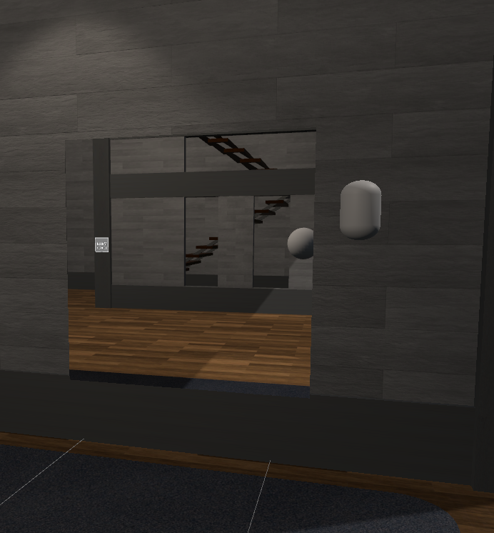
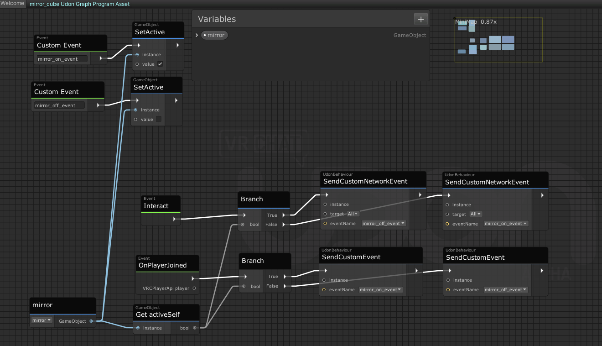
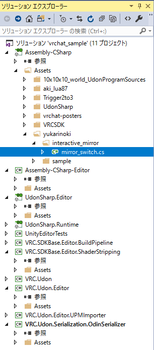
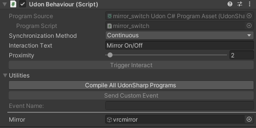
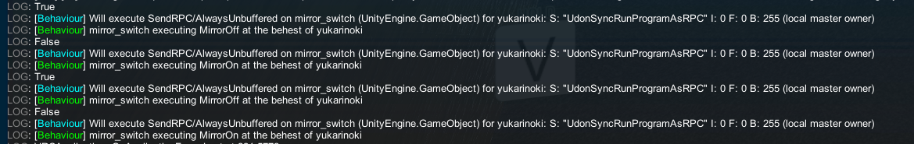

# 概要
近年メタバースの筆頭として注目されているVRChatでは、各ユーザーがワールドを自作することができます。単に建物や景観を作成するだけなら3DCGスキルで十分ですが、ユーザーの挙動に応じてワールドが変化するようなギミックを作るにはUdonを用いたプログラミングが必要になります。UdonはVRChat上で独自のギミックを作成するためのツールとしてはほとんど唯一の選択肢になっています。

Udonを最も簡易的に利用する方法はUdon Graphを用いた方法であり、この方法についての解説記事がネット上で大半を占めています。しかし、一定以上に複雑なギミックを作成する場合には、Udon Graphを用いた手法は複雑度・実装速度の面から見て現実的ではありません。例えば、大人気World AmongUsVRには、AmongUsのほぼすべての機能が実装されていますが、これをUdon Graphを用いてプログラムすることは不可能だろうと容易に想像出来ると思います。そのため、Udonを直接C#でコーディングできるUdonSharpを利用する方法が重要になります。

本稿は、Udon Sharpを用いたC#によるプログラミングの方法を、Udon Graphによる実装と対応させながら解説することで、現在Udon Graphを使用しているユーザーがC#実装に一歩踏み出すための手助けになることを目指しました。


# 事前知識
VRChatのワールド作成、Udon Graphによるプログラミングについての知識を仮定します。
具体的には、
### VRChatワールド作成
* おくらすVRちゃんねる氏のワールド作成動画　再生リスト    
https://www.youtube.com/watch?v=_0vgPjV4YZk&list=PLdywIhUp6C4o_mNKGedMFRlbckXWv_UpD

### Udon Graphによるプログラミング
* Udon のはじめかた　(toe氏)  
https://note.com/toh_csecb/n/nc57eb0e73d27  

* VRCワールドのSDK3 UDON(graphのほう)でミラーをオンする (かくちゅ氏)  
https://note.com/kakutyu50/n/nc8bbe6cfc1c2

* sdk3のudonでミラーをオンオフする(ついでに同期させる)  (かくちゅ氏)  
https://note.com/kakutyu50/n/n12052eba0b39


以上すべてを実際に手を動かしてやって頂ければ、本稿を読むうえで必要十分の知識が得られます。

# 事前準備
本稿は「sdk3のudonでミラーをオンオフする(ついでに同期させる)」で作成したミラースイッチ実装を出発点とするので、それが実装された状態にしてください。  
あと、C#によるコーディングにはUdon Sharpが必要なので、以下からパッケージをDownload & Importしてください。

* Udon Sharp/release  
https://github.com/MerlinVR/UdonSharp/releases 

あと、必須かわからないのですが、Visual Studioをインストールしておいてください。


# 1. C#コードを動かすまで

## 出発点
「sdk3のudonでミラーをオンオフする(ついでに同期させる)」でミラースイッチ実装を作成していると、以下のようなオブジェクトとそれに付与されたUdon Graphがあるはずです。（僕の実装では、ユーザーがそのワールドにJoinした時の処理も追加してあります。画像はクリックで拡大してください。）




*このUdon graphと同様の処理を行うC#コードの実装について解説していきます。*

同じものを実装するので、このオブジェクトの隣に、同じような配置で鏡とスイッチのオブジェクトを作成してください。(1)

## C#でコーディングするモード
スイッチのオブジェクトにUdon Behaviourを追加してください。New Programの下のドロップダウンから`Udon C# Programing Asset`を選択し、New Programをクリック、続けてCreate Scriptもクリックしてください。すると、ファイルを保存するディレクトリを聞かれるので、どこでもいいので保存してください（僕は`プロジェクト直下/Assets/yukarinoki/interactive_mirror`というディレクトリに設定しました）。保存すると、おそらくVisual Studioが開くと思います。開いたら右側のソリューションエクスプローラーの一番上から、Assembly-Csharpを開いて自分が先ほど保存したファイル開いてください。（僕の環境では以下の場所にあります。）



すると左側に以下のコードが現れると思います。
```csharp
using UdonSharp;
using UnityEngine;
using VRC.SDKBase;
using VRC.Udon;

public class mirror_switch : UdonSharpBehaviour
{
    void Start()
    {
        
    }
}
```

## 鏡スイッチのC#コード
上のコード削除して、以下のコードを貼り付けてください。ただ、mirror_switchの部分は自分のオブジェクト名にしてください。
```csharp
using UdonSharp;
using UnityEngine;
using VRC.SDKBase;
using VRC.Udon;
using UnityEngine.UI;


public class mirror_switch : UdonSharpBehaviour
{
    [SerializeField] private GameObject mirror;

    private bool is_active = false;

    public override void Interact()
    {
        Debug.Log(is_active);
        if (is_active)
        {
            SendCustomNetworkEvent(VRC.Udon.Common.Interfaces.NetworkEventTarget.All, "MirrorOff");
        }
        else
        {
            SendCustomNetworkEvent(VRC.Udon.Common.Interfaces.NetworkEventTarget.All, "MirrorOn");
        }
    }

    public void MirrorOn()
    {
        mirror.SetActive(true);
        is_active = true;
    }
    public void MirrorOff()
    {
        mirror.SetActive(false);
        is_active = false;
    }

    public override void OnPlayerJoined(VRCPlayerApi player)
    {
        if (is_active)
        {
            SendCustomEvent("MirrorOn");
        }
        else
        {
            SendCustomEvent("MirrorOff");
        }
    }
}
```

## コンパイル & オブジェクト設定
Unityに戻り、スイッチオブジェクトのUdon BehaviourのCompile All UdonSharpo Programsをクリックしてください。すると、UtilitiesのところにMirrorというオブジェクト設定項目で出ていると思います。ここにVRCMirrorのオブジェクトを設定してください。


## 動作確認
VRshat SDKからBuildテストをしてみてください。Udon Graphと同様にスイッチで動作することが確認できると思います。


# 2. コード解説
## 他オブジェクトの利用

以下の部分が、そのコードが使用する他オブジェクトの宣言になります。ここに宣言されるとコンパイル時にUdon Sharpが読み取り、変数名(mirror)と同名のオブジェクト設定項目(Mirror)が出てくるようになっています。先頭が大文字になるのは仕様です。
```csharp
public class mirror_switch : UdonSharpBehaviour
{
    [SerializeField] private GameObject mirror; /*ここを見てUdonは対象オブジェクトを判断*/

    private bool is_active = false;
```

試しに、以下のように変更してコンパイルしてみましょう。すると、Sizeというパラメータを含んだ設定が出てきますね。複数同じようなオブジェクトを管理したいときには配列を使うのが便利です。
```csharp
public class mirror_switch : UdonSharpBehaviour
{
    [SerializeField] private GameObject mirror; 
     [SerializeField] private GameObject[] tekitou; /*変更*/

    private bool is_active = false;
```

##　Interact時の挙動の設定
以下の部分がInteract時の挙動の設定コードです。

```csharp
 public override void Interact()
    {
        Debug.Log(is_active);
        if (is_active)
        {
            SendCustomNetworkEvent(VRC.Udon.Common.Interfaces.NetworkEventTarget.All, "MirrorOff");
        }
        else
        {
            SendCustomNetworkEvent(VRC.Udon.Common.Interfaces.NetworkEventTarget.All, "MirrorOn");
        }
    }
```

overrideでUdonSharpBehaviour内のInteract()を上書きしています。  

is_activeに応じて条件分岐した上で、SendCustomNetworkEvent()で全員を対象に"MirrorOff"か"MirrorOn"というCustomEventを発火させています。

### デバッグ
複雑なコードになると当然デバッグが必要になります。手軽なデバッグ方法として、ログ出力があります。それは以下の部分です。
```csharp
    {
        Debug.Log(is_active);　// ここ
        if (is_active)
        {
```

これで変数がログに出力されます。

一体ログはどこでみるのかという話なんですが、VRChatを起動して、`右SHIFT + バッククウォート + 3` を押してみるとログが立ち上がります。（日本語キーボードなら、`右SHIFT + @ + 3`ということです。ログが開かない人はVRChat内の設定画面を開いてから同じキーを入力してみるとうまくいくかも？） 
これで、スイッチにインタラクトすると以下のようなログ出力が確認できます。


## CustomEventに対応する挙動の設定
CustomEventに対応するには、そのイベント名と同名の関数を宣言します。
```csharp
    public void MirrorOn()
    {
        mirror.SetActive(true);
        is_active = true;
    }
    public void MirrorOff()
    {
        mirror.SetActive(false);
        is_active = false;
    }
```
オブジェクトの存在は.SetActive()で変更できます。

## Eventに対応する挙動の設定
Udon Graphのときと同じ名前の関数をoverrideで宣言します。他は解説することがないと思います。

```csharp
public override void OnPlayerJoined(VRCPlayerApi player)
    {
        if (is_active)
        {
            SendCustomEvent("MirrorOn");
        }
        else
        {
            SendCustomEvent("MirrorOff");
        }
    }
```

#　あとがき
まず、パッと見ただけでも、C#のほうがUdon Graphより簡単だということがわかってもらえると思います。この複雑度でこの差ですから、もう少し複雑になるとUdonSharpの効用は計り知れないと思います。  C#実装をみて、「Udon Graphは意外と簡単にC#に変換できるんだな」ということだけでもわかってもらえると嬉しいです。

本稿の内容だけで概念としては、Udon Sharpの実装のほぼすべてみたいな感じになると思いますが、実際にはいろいろ複雑な部分もあります。    
もう少し勉強したい方はaki_lua87氏が実装されたoxゲーム、リバーシのコードを確認してみると良いと思います。  
https://aki-lua87.booth.pm/  

