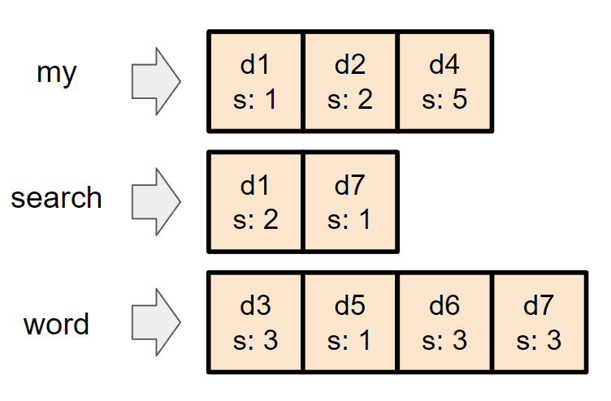

# 概要
WANDやblock WANDについて日本語の資料が少なかったので、まとめておく。

# 情報検索
この記事において、情報検索とは、「複数の単語を入力し、大量のドキュメントの中から、入力単語と最も関連性が強いドキュメントを、関連性が高い順に出力するもの」をいう。

### Top-k query
Top-kクエリとは、上の情報検索において、上位k個を求めるクエリのことである。Top-1なら、最も関連性の強い一つのドキュメントを出力する。

# 転置インデックス
転置インデックスとは、それぞれのドキュメントについて、単語ごとの関連スコアを計算し、それを隣接リストの形にまとめたものである。   
例えば、my, search, wordの3つの単語について、d1からd7までの7つのドキュメントから、転置インデックスを求めたものは下図のようになる。  

情報検索において、転置インデックスは事前計算しておくこととする。  
このスコア(s: 2など)は、具体的にはドキュメント中のその単語の出現頻度などである。

## ドキュメントのスコア
例えば、上図の転置インデックスを持つドキュメント群に対して、"my search word"という3つの単語で検索を行ったとする。この時、"my search word"に対するドキュメントd1のスコアをどう求めるかはいろいろな流儀がある。単純に和を取る方法（1 + 2 = 3がスコアになる）、もしくは単語の重要度を入力しスコアと内積を取る方法（例えば、{my: 1, search:3, word: 2}のように入力し、スコア 1 * 1 + 2 * 3 + 0 * 2 = 6を得る）などがある。  

この記事では、単純に和を取る方法を採用した場合について記述する。

# 情報検索アルゴリズム
転置インデックスが与えられれば、ナイーブには、すべての転置インデックスを確認し、すべてのドキュメントについてスコアを求め、それをpriority queueに入れていけば、Top-kクエリに回答できる。  

なので、情報検索アルゴリズムは「転置インデックスの読み取り回数をいかに少なくするか(= 転置インデックスをいかにスキップするか)」を工夫することになる。

# DAAT(Document At A Time)
DAATは、ナイーブな情報検索アルゴリズムです。Document At A Timeという名前の通り、その時のドキュメントを見ていくアルゴリズムです。

まず、すべての検索ワードの転置インデックスの先頭にポインタを置きます。
DAATは各イテレーションで、ポインタが置かれているドキュメントのうち最もドキュメントIDの小さいドキュメントについてスコアを計算します。スコア計算に使われたポインタをその転置インデックスの次の要素に移動させます。これをすべてのポインタが転置インデックスの終端に着くまで行います。

# ナイーブに毛が生えたアルゴリズム

todo
# WANDアルゴリズム

todo